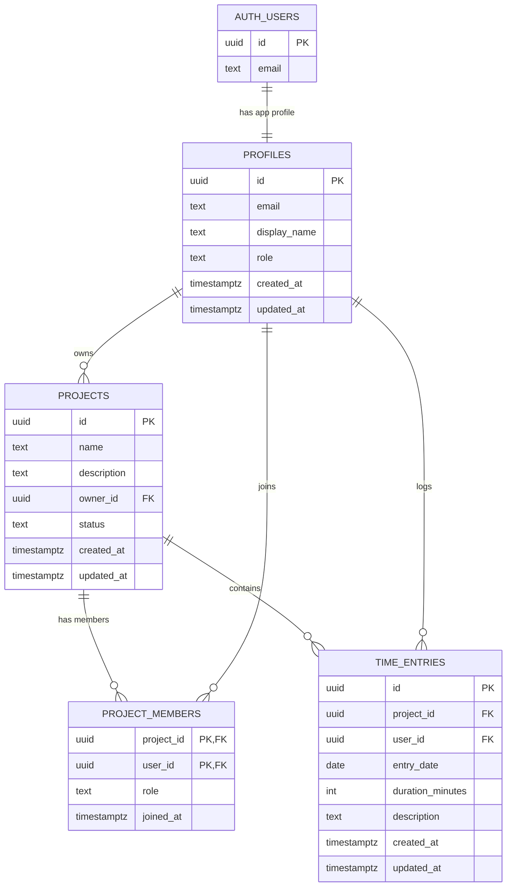

# Database

This document describes the Supabase PostgreSQL foundation for the study time tracking MVP.

## Tables

### `profiles`

Stores application-specific user data for Supabase Auth users.

- `id`: primary key and foreign key to `auth.users(id)`
- `email`: copied from Supabase Auth for display and lookup
- `display_name`: optional user-facing name
- `role`: `user` or `admin`, default `user`
- `created_at`, `updated_at`: timestamps

Passwords are never stored in this table. Supabase Auth owns credentials.

### `projects`

Stores shared study projects.

- `id`: primary key
- `name`: 2 to 100 characters
- `description`: optional, max 1000 characters
- `owner_id`: project owner profile
- `status`: `active` or `archived`, default `active`
- `created_at`, `updated_at`: timestamps

Project names are not globally unique.

### `project_members`

Connects users to projects.

- `project_id`: project foreign key
- `user_id`: profile foreign key
- `role`: `owner` or `member`
- `joined_at`: timestamp

The primary key is `(project_id, user_id)`, so a user cannot be added to the same project twice. A partial unique index allows only one `owner` membership per project.

### `time_entries`

Stores study work durations.

- `id`: primary key
- `project_id`: project foreign key
- `user_id`: profile foreign key
- `entry_date`: date of the work
- `duration_minutes`: integer from 1 to 1440
- `description`: optional, max 500 characters
- `created_at`, `updated_at`: timestamps

ECTS credits are calculated from `duration_minutes`. They are not stored.

## Relationships



## Helper Functions

The migration defines these authorization helpers:

- `is_admin(user_id uuid)`
- `is_project_member(project_id uuid, user_id uuid)`
- `is_project_owner(project_id uuid, user_id uuid)`
- `is_project_active(project_id uuid)`

They are `security definer` functions with a fixed `search_path` of `public, pg_temp`. They are safe because they:

- Accept explicit IDs instead of trusting client-provided session state directly.
- Only perform simple `exists` reads.
- Do not use dynamic SQL.
- Do not modify data.
- Avoid recursive RLS policy lookups by reading the needed relationship tables directly.

## Triggers

Reusable timestamp logic:

- `set_updated_at()` updates `updated_at` on `profiles`, `projects`, and `time_entries`.

Auth/profile sync:

- `handle_new_auth_user()` creates a profile when Supabase Auth creates a user.
- `sync_profile_from_auth_user()` keeps profile email/display name aligned with Auth metadata.

Ownership protections:

- `protect_profile_role()` prevents users from changing their own role or profile email.
- `create_owner_membership()` adds the project owner as a member after project creation.
- `prevent_project_owner_change()` blocks ownership transfer for the MVP.
- `protect_project_owner_membership()` prevents owner membership deletion or accidental duplicate owner behavior.
- `enforce_time_entry_user()` sets inserted time entries to the authenticated user and prevents ownership changes.

## RLS Summary

RLS is enabled on all application tables.

Profiles:

- Users can read their own profile.
- Users can update their own safe profile fields.
- Users cannot promote themselves to admin.
- Admins can read profiles for administration.

Projects:

- Members can read projects they belong to.
- Authenticated users can create projects only with themselves as owner.
- The owner membership is created by trigger.
- Owners can update or archive their projects.

Project members:

- Members can view membership for projects they belong to.
- Owners can add or remove normal members.
- Members cannot add themselves to arbitrary projects.
- Owner membership cannot be removed through normal member removal.

Time entries:

- Users can read their own entries.
- Project owners can read entries for their projects.
- Users can insert entries only for themselves and only into active projects where they are members.
- Users can update or delete only their own entries.

## Indexes

Indexes support:

- Project ownership lookup: `projects(owner_id)`
- Membership lookup by user: `project_members(user_id)`
- Time entries by user: `time_entries(user_id)`
- Time entries by project: `time_entries(project_id)`
- Time entries by date: `time_entries(entry_date)`
- Report queries by user and date: `time_entries(user_id, entry_date)`

## TypeScript Types

`src/types/database.ts` currently contains hand-maintained database types matching the initial migration.

After a Supabase development project is connected, prefer regenerating types with:

```bash
npx supabase gen types typescript --project-id YOUR_PROJECT_REF --schema public > src/types/database.ts
```

For a local Supabase instance, use:

```bash
npx supabase gen types typescript --local --schema public > src/types/database.ts
```
